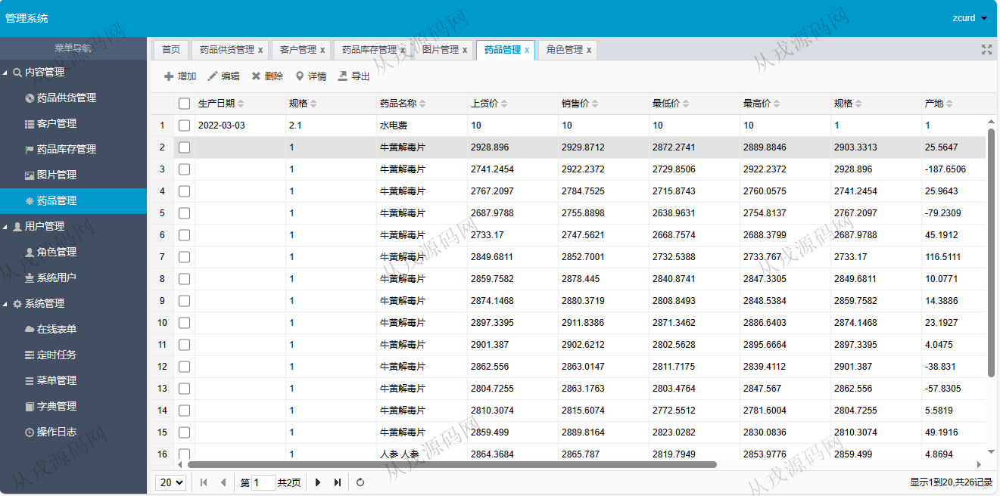
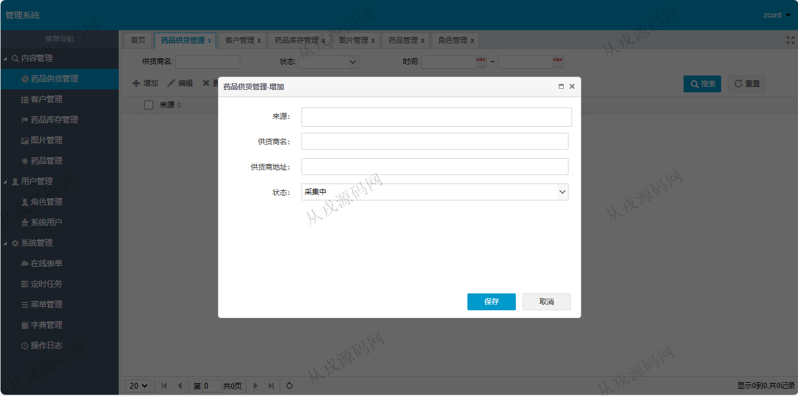
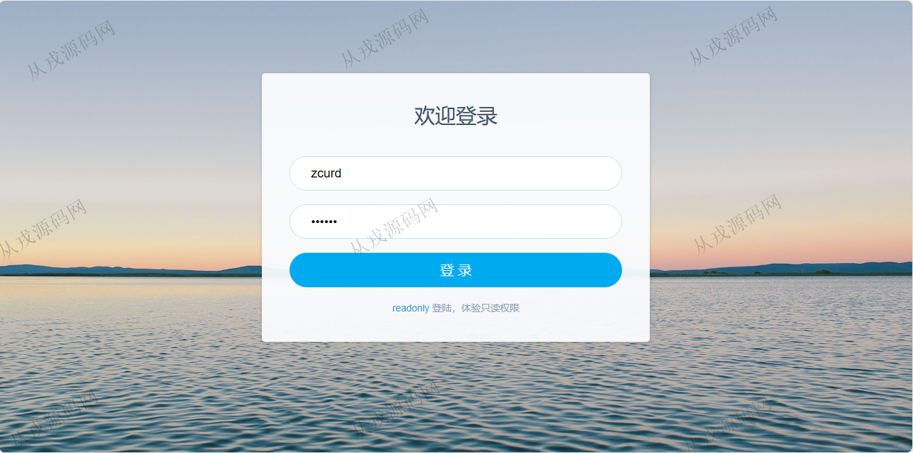
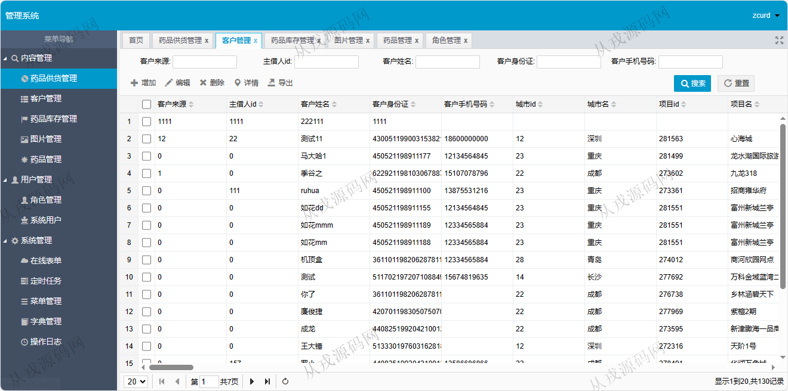
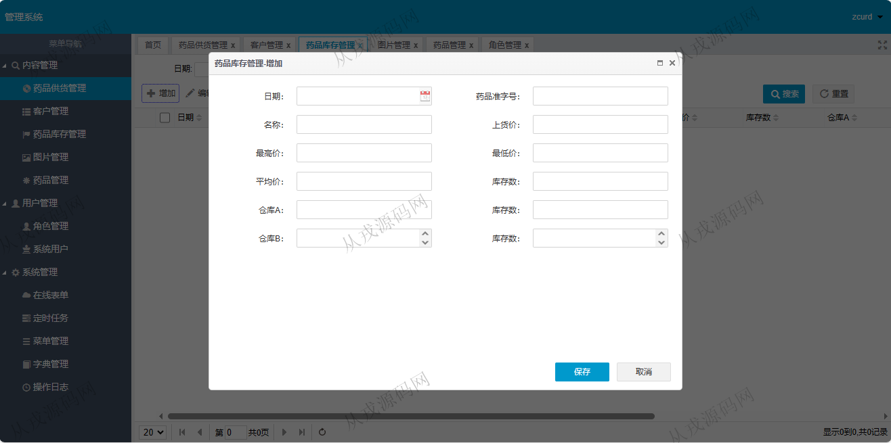
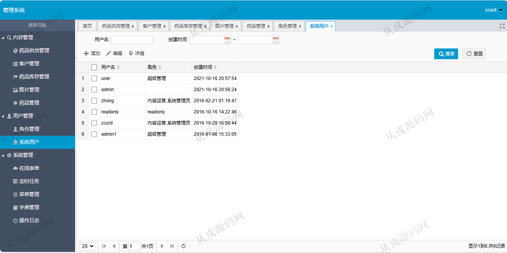
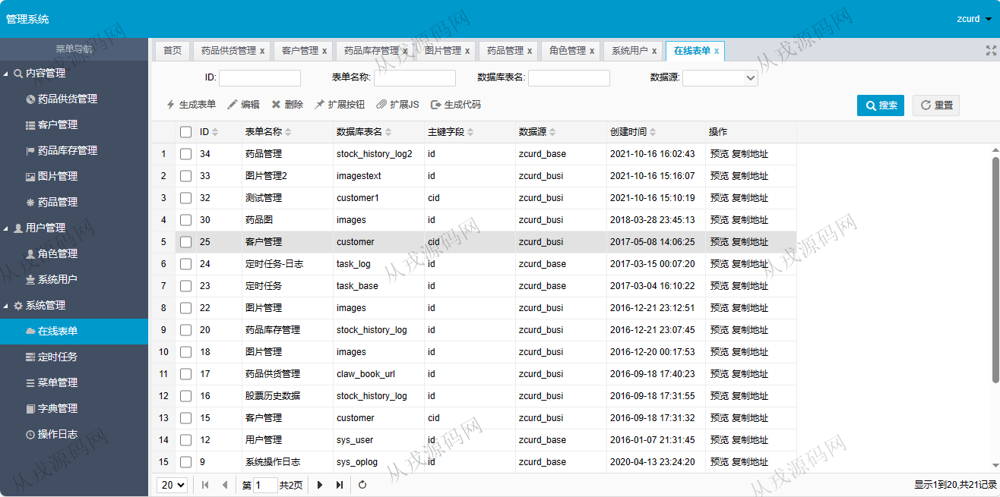
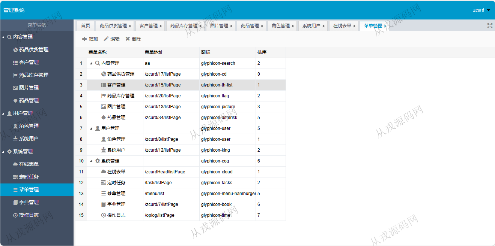
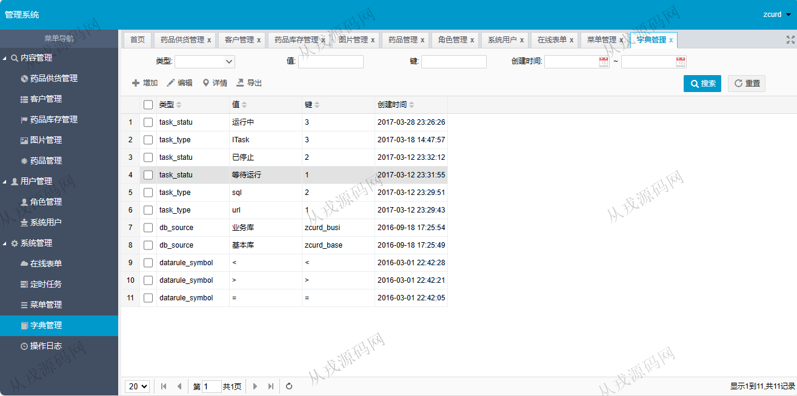

<h1 align="center">101.药品管理系统</h1>

- <b>完整代码获取地址：从戎源码网 ([https://armycodes.com/](https://armycodes.com/))</b>
- <b>技术探讨、资料分享，请加QQ群：692619798</b> 
- <b>作者微信：19941326836  QQ：952045282</b> 
- <b>承接计算机毕业设计、Java毕业设计、Python毕业设计、深度学习、机器学习</b>
- <b>选题+开题报告+任务书+程序定制+安装调试+论文+答辩ppt 一条龙服务</b>
- <b>所有选题地址 ([https://github.com/YuLin-Coder/AllProjectCatalog](https://github.com/YuLin-Coder/AllProjectCatalog)) </b>

## 项目介绍
基于jfinal的药品管理系统：前端 html、jquery、easyui，后端 maven、jfinal、mybatis，角色分为管理员、内容运营、只读；集成药品供货管理、客户管理、药品库存管理、药品管理等功能于一体的系统。

## 功能介绍

- 药品供货管理：药品供货信息的增删改查，多条件搜索查询，导出
- 客户管理：客户信息的增删改查，导出
- 药品库存管理：库存信息的增删改查，导出
- 图片管理：图片信息的增删改查，导出
- 药品管理：药品信息的增删改查，导出
- 角色管理：角色信息的增删改查
- 系统用户：用户信息的增删改查，用户分配角色（可选择多个角色）
- 系统管理：在线表单，定时任务，菜单管理，字典管理，操作日志

## 环境

- <b>IntelliJ IDEA 2021.3</b>

- <b>Mysql 5.7.26</b>

- <b>Tomcat 7.0.73</b>

- <b>JDK 1.8</b>

## 运行截图

